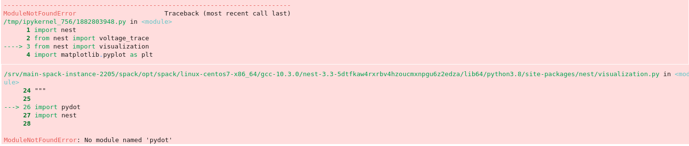
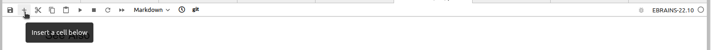
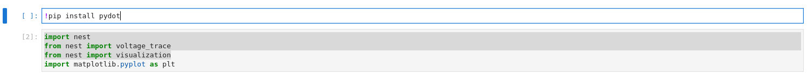

.. _run_jupyter:

How to run Jupyter notebooks
============================

Using EBRAINS JupyterHub
------------------------

Prerequisites

  * an EBRAINS account

    If you do not have an account yet, you can sign up here: https://ebrains.eu/register.

1. Click on the |tryit| button in the desired :ref:`example notebook <nest:pynest_examples>`

   You will be redirected to https://lab.ebrains.eu

2. If you are not signed into EBRAINS already, you will be asked to sign in.

3. Choose a lab execution site:

  .. image:: _static/img/lab-execution-site-de.png

4. Start the server

   If no server is running, you will be prompted to start the server. This will cause the URL to be updated and a generic Jupyterhub instance will be loaded.

   To open the desired notebook, you will have to select the `Try it On EBRAINS` button **a second time** in the NEST documentation.

   Note that if the server is already running, your Jupyter notebook will be loaded into JupyterHub automatically.

   The other notebooks will be available in JupyterHub in the left column, as well.

Now you can run the notebook and change variables to test how it works!

.. important::

   If you want to save any changes you made you need to move the file to either your shared folder in EBRAINS or
   download it to your computer.

----

Troubleshooting
---------------

Error: Command returned non-zero status 128
~~~~~~~~~~~~~~~~~~~~~~~~~~~~~~~~~~~~~~~~~~~

JupyterHub fails to clone the repository.

  .. image:: _static/img/error-jupyter-ebrains.png

* Select the ``Control Panel`` button on top of page.

* Stop the server - this may take several minutes.

.. warning::

    If you stop the server, you will lose any changes you made during your session that
    have not been stored on your computer or in the shared folder.
    Download or move any files you wish to keep before restarting the server!

    You can return to JupyterHub by clicking on JupyterHub icon on the Control Panel.

* Once the server stops, you can retry running the notebook again.

 Alternatively, you can try another execution site.

``ModuleNotFoundError``:  ``no module named nest``
~~~~~~~~~~~~~~~~~~~~~~~~~~~~~~~~~~~~~~~~~~~~~~~~~~

The active notebook fails at importing ``nest`` module.

* Check that the kernel version is correct (EBRAINS-22.10 and later should be compatible with NEST notebooks).

  .. image:: _static/img/kernel-version-jupyter.png

``ModuleNotFoundError``: any other module besides ``nest``
~~~~~~~~~~~~~~~~~~~~~~~~~~~~~~~~~~~~~~~~~~~~~~~~~~~~~~~~~~~

The active notebook fails at importing one or several required modules or packages.

* Check that the kernel version is correct (EBRAINS-22.10 and later should be compatible with NEST notebooks).

* Before the import line in the notebook, insert a new cell.

* Install the missing module with pip, note the exclamation mark before pip:

  .. code-block::

   !pip install module-name

If the module is installed successfully, you can try to rerun the notebook.

----

Still not working?
~~~~~~~~~~~~~~~~~~

`Create an issue on GitHub <https://github.com/nest/nest-simulator/issues/new/choose>`_.

The developer team will look into issues as quickly as possible.

.. |tryit| image:: https://nest-simulator.org/TryItOnEBRAINS.png
           :width: 200px

